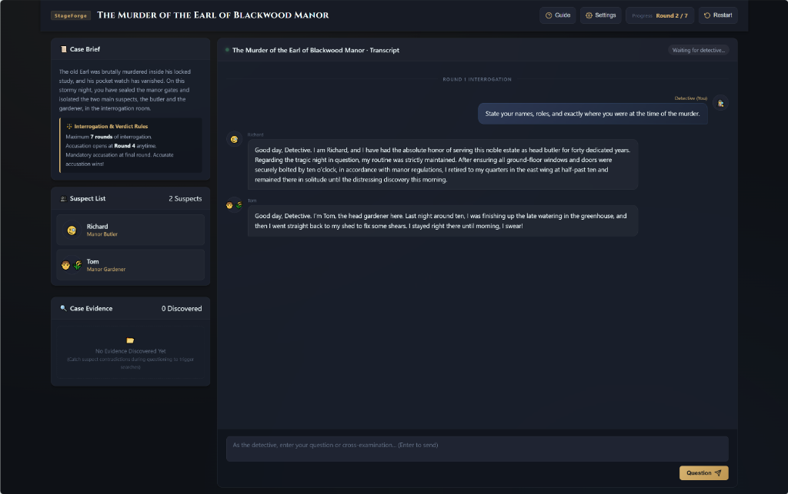
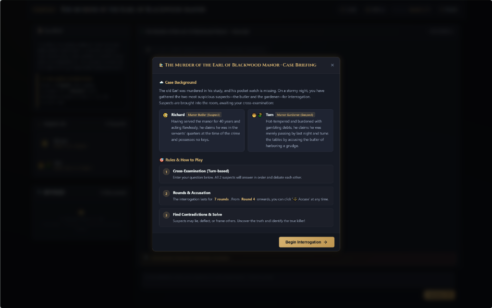
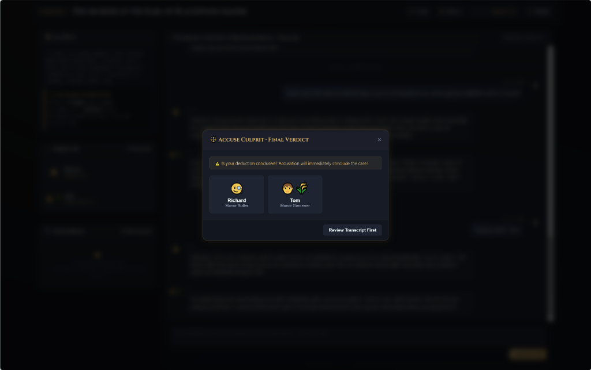
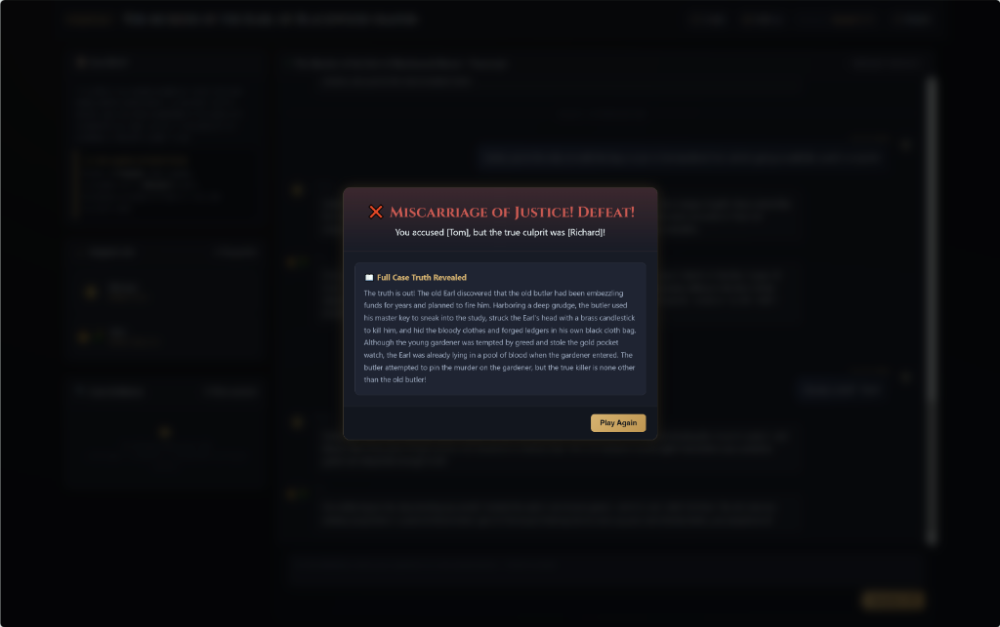

# StageForge

> **A high-concurrency, schema-driven multi-agent deduction runtime engine with Hybrid RAG & accelerated LLM serving.**

[](https://www.python.org/)
[](https://fastapi.tiangolo.com/)
[](LICENSE)
[]()

StageForge is a modular, configuration-driven multi-agent deduction and interactive social deduction engine. It bridges dynamic narrative scenarios and large language model (LLM) orchestration, providing zero-code script extensibility, hybrid dense-sparse knowledge retrieval (RAG), high-performance prefix-cached serving (SGLang), and resilient multi-tier fallback architecture.

---

## 📸 Demo & UI Showcase

| **Interrogation Room & Live Transcript** | **Case Briefing Dossier** |
| :---: | :---: |
|  |  |
| **Accusation & Final Verdict** | **Deduction Truth Reveal & Outcome** |
|  |  |

---

## ✨ Key Features

- 📄 **100% Schema-Driven Decoupling**: Narrative world-lore, suspect personas, dynamic clue distribution, round schedules, and avatar representations are fully parameterized via YAML with **Pydantic v2** validation. Zero hardcoding in engine core.
- 🔌 **Model Context Protocol (MCP 2.x) Integration**:
  - Exposes active case resources (`case://brief`, `case://suspects`) and forensic tools (`inspect_clue`, `query_manor_lore`, `check_alibi_timeline`) via standard MCP Server & Client architecture, empowering agents to dynamically verify physical evidence.
- 🛡️ **Anti-Hallucination & Dialogue Grounding Protocol**:
  - **Zero Ghost Arguments**: Engine-level strict constraint preventing suspects from fabricating unsaid accusations or reacting to ghost claims across turns.
  - **Explicit Round Markers & Perspective Isolation**: Sliding-window buffer transforming dialogues dynamically per agent (`assistant` for self, named `user` for others) with cross-round timeline preservation.
- 🔍 **Hybrid Retrieval-Augmented Generation (Hybrid RAG)**:
  - **Dense + Sparse Dual-Path Recall**: Combines **ChromaDB** vector search for semantic relevance and **BM25Plus** (with Jieba tokenizer) for precise keyword matching on forensic items, timestamps, and locations.
  - **Reciprocal Rank Fusion (RRF)**: Merges and reranks retrieved context to eliminate hallucinations in investigative deductions.
- ⚡ **High-Throughput Serving & Structured Decoding**:
  - **SGLang & RadixAttention**: Leverages prefix caching for long, shared world-lore prompts across suspects, reducing prompt prefill latency (TTFT) by reusing KV cache.
  - **Constrained Decoding**: Supports JSON Schema and regex-guided generation for deterministic agent outputs and state transitions.
- 🛡️ **Fault-Tolerant Multi-Tier Model Failover**:
  - Seamlessly handles `HTTP 429` (Quota Exhaustion) and upstream timeouts via an automated failover chain: **Local SGLang Cluster ➔ Primary LLM API ➔ Dynamic Backup Model Pool**.
- ⚙️ **Deterministic Asymmetric State Machine (FSM)**:
  - Manages round-robin conversational turns, interrogation limits, contradiction-triggered clue searches, accusation trials, and victory/defeat evaluations.
- 🌐 **Modern Interactive Bilingual Web UI & CLI**:
  - Full-featured dark/light mode Web interface with real-time SSE streaming, interactive clue discovery & dismissal bar, bilingual hot-switching (English & Chinese), character dossier tabs, and responsive layout.

---

## 🏗️ Architecture Overview

```text
┌────────────────────────────────────────────────────────────────────────┐
│ 1. Configuration & Narrative Layer (Schema-Driven & i18n)              │
│    configs/*.yaml ──> ConfigLoader (Pydantic v2 Validation)            │
│    src/config/translator.py (Dynamic bilingual translation & fallback) │
└───────────────────────────────────┬────────────────────────────────────┘
                                    │ Validated GameConfig
                                    ▼
┌────────────────────────────────────────────────────────────────────────┐
│ 2. Runtime Core & State Orchestration (StageForge Engine)             │
│    ├── TurnScheduler (FSM, Turn advancement, Accusation Verdict)      │
│    ├── MemoryManager (Sliding window context & persona isolation)      │
│    ├── GroundingProtocol (Strict zero-hallucination constraint)        │
│    ├── Model Context Protocol (MCP Server & Tools integration)         │
│    └── HybridRAGEngine (BM25Plus + ChromaDB + Reciprocal Rank Fusion)  │
└──────────────────┬─────────────────────────────────┬───────────────────┘
                   │ Turn: Player (Detective)         │ Turn: Multi-Agent Suspect
                   ▼                                 ▼
┌───────────────────────────────────┐ ┌──────────────────────────────────┐
│ 3. Interactivity Layer            │ │ 4. Resilient LLM Serving Layer   │
│    ├── Web UI (FastAPI + SSE)     │ │    ├── SGLang (RadixAttention)   │
│    ├── Interactive Clue Search    │ │    ├── Primary Cloud LLM API     │
│    └── CLI Terminal Input         │ │    └── Dynamic Backup Model Pool │
└──────────────────┬────────────────┘ └──────────────────┬───────────────┘
                   │ Event Broadcast                     │ Model Response
                   └────────────────┬────────────────────┘
                                    ▼
                   ┌─────────────────────────────────┐
                   │ 5. Memory Append & Event Stream │
                   └─────────────────────────────────┘
```

---

## 📁 Repository Structure

```text
.
├── configs/                            # Scenario definitions (2, 6, 12 suspects)
│   ├── detective_mystery.yaml          # Manor Mystery (2 suspects: Butler & Gardener)
│   ├── snow_mansion_6suspects.yaml     # Snowbound Mansion (6 suspects)
│   └── orient_express_12suspects.yaml  # Express Murder (12 suspects)
├── docs/                               # Documentation & Assets
│   └── images/                         # Web UI screenshots and demo previews
├── src/
│   ├── api/                            # FastAPI backend application
│   │   └── server.py                   # REST endpoints, SSE streams, clue search
│   ├── config/                         # Schema validation, i18n & YAML loader
│   │   ├── loader.py                   # YAML loader with strict Pydantic parsing
│   │   ├── schema.py                   # Pydantic v2 models (GameConfig, AgentConfig, etc.)
│   │   ├── strings.py                  # Centralized bilingual string registry
│   │   └── translator.py               # Dynamic config translation & offline dictionary
│   ├── engine/                         # FSM runtime & turn scheduler
│   │   ├── runtime.py                  # Core engine lifecycle & accusation handling
│   │   ├── scheduler.py                # Asymmetric turn FSM & round coordinator
│   │   └── session.py                  # Game session, grounding protocols & clue triggers
│   ├── llm/                            # LLM clients & multi-tier circuit breakers
│   │   ├── client.py                   # Model failover pipeline (SGLang -> OpenAI -> Gemini fallback)
│   │   └── sglang_client.py            # SGLang RadixAttention client
│   ├── mcp_server/                     # Model Context Protocol (MCP 2.x) support
│   │   ├── client.py                   # In-process & async MCP client
│   │   └── server.py                   # Case dossier resources & forensic tools
│   └── memory/                         # Dialog buffer & Hybrid RAG engine
│       ├── buffer.py                   # Sliding-window context & perspective translation
│       └── rag.py                      # ChromaDB + BM25Plus + RRF implementation
├── static/                             # Web UI frontend (Vanilla JS & Modern CSS)
│   ├── index.html                      # Single-page interrogation room interface
│   ├── style.css                       # Sleek dark-mode design system & animations
│   ├── strings.js                      # Client-side i18n translation dictionary
│   └── app.js                          # State management, SSE, and interactive clue verification
├── tests/                              # Pytest test suite (28 tests passing)
│   ├── test_config.py                  # Schema validation tests
│   ├── test_mcp.py                     # MCP server, tools & client tests
│   ├── test_memory.py                  # Sliding window & perspective mapping tests
│   ├── test_rag_sglang.py              # BM25Plus, ChromaDB & SGLang tests
│   ├── test_runtime.py                 # Turn progression & accusation outcome tests
│   ├── test_scheduler.py               # FSM lifecycle tests
│   ├── test_session.py                 # Full game session integration tests
│   └── test_translation.py            # Bilingual translation tests
├── main.py                             # Unified CLI & Web entry point
├── pyproject.toml                      # Project metadata & build specs
├── requirements.txt                    # Python dependencies
└── README.md
```

---

## 🚀 Quick Start

### 1. Prerequisites & Environment Setup

```bash
# Clone the repository
git clone https://github.com/link1697/StageForge.git
cd StageForge

# Create & activate a virtual environment
python3 -m venv .venv
source .venv/bin/activate

# Install dependencies
pip install -r requirements.txt
```

### 2. Configure Model API Keys 

Copy the environment template:
```bash
cp .env.example .env
```

Edit `.env` with your API configuration (supports OpenAI, DeepSeek, Google Gemini, Ollama, etc.):
```env
# Primary LLM Configuration
OPENAI_API_KEY=your_api_key_here
OPENAI_BASE_URL=https://api.openai.com/v1
OPENAI_MODEL_NAME=gpt-4o-mini

# Google Gemini (Optional Fallback / Primary)
GEMINI_API_KEY=your_gemini_key_here

# SGLang Local Server (Optional for extreme inference acceleration)
SGLANG_API_URL=http://localhost:30000
```
 
---

### 3. Launching StageForge

#### Option A: Web Interface (Recommended)
```bash
# Launch interactive Web UI on http://localhost:8000
python main.py --web

# Or specify a custom scenario
python main.py --web --config configs/snow_mansion_6suspects.yaml
```

#### Option B: Terminal CLI (Interactive Detective Mode)
```bash
# Run Manor Mystery scenario (2 suspects)
python main.py -c configs/detective_mystery.yaml

# Run Snowbound Mansion scenario (6 suspects)
python main.py -c configs/snow_mansion_6suspects.yaml
```

#### CLI Parameters:
| Flag | Description | Default |
| :--- | :--- | :--- |
| `-c, --config` | Path to narrative scenario YAML | `configs/detective_mystery.yaml` |
| `--web` | Start FastAPI web server instead of CLI | `False` |
| `--host` | Web server bind address | `127.0.0.1` |
| `--port` | Web server port | `8000` |
| `--model` | Temporarily override default LLM model name | Config default |
| `--window` | Sliding memory window size | `10` |

---

## 🧪 Testing

StageForge includes a comprehensive automated test suite with full coverage across schema validation, MCP server/tools, sliding-window memory buffers, turn schedulers, Hybrid RAG indexing, SGLang fallback logic, and dynamic translation:

```bash
.venv/bin/pytest -v
```

Output:
```text
tests/test_config.py .......                  [ 25%]
tests/test_mcp.py ...                         [ 35%]
tests/test_memory.py ...                      [ 46%]
tests/test_rag_sglang.py .....                [ 64%]
tests/test_runtime.py ...                     [ 75%]
tests/test_scheduler.py ..                    [ 82%]
tests/test_session.py ...                     [ 92%]
tests/test_translation.py ..                  [100%]

======================== 28 passed in 4.87s ========================
```

---

## 📄 License

This project is open-sourced under the [MIT License](LICENSE).
